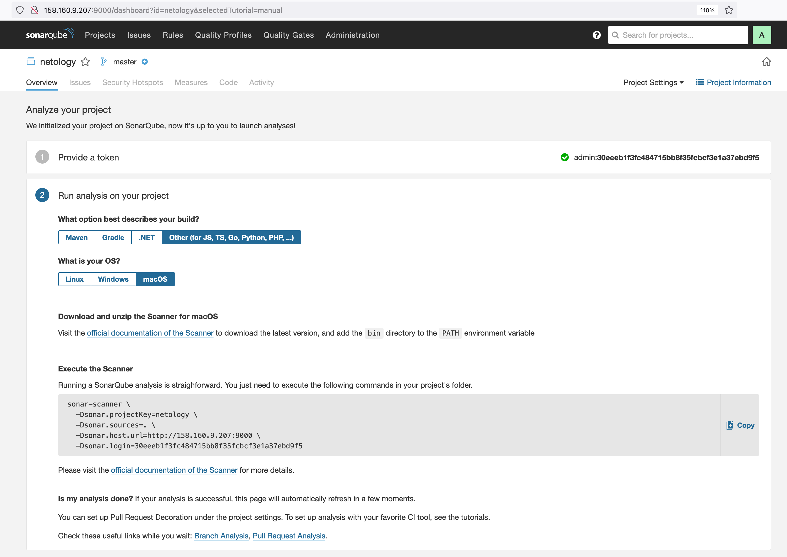
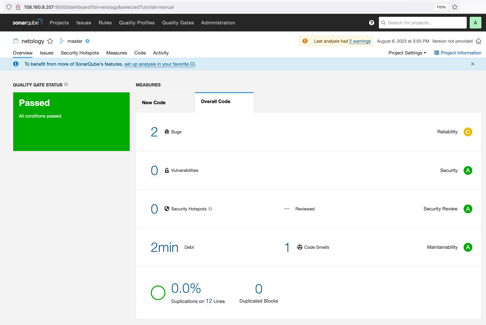
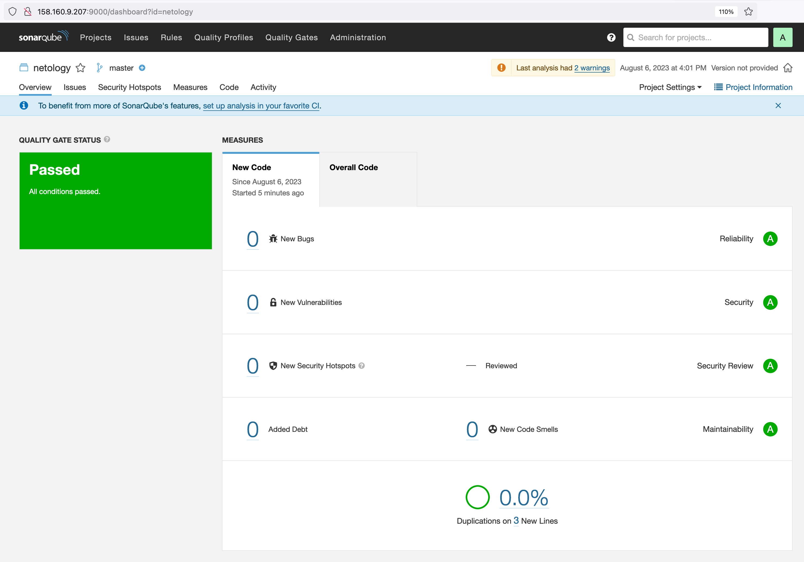
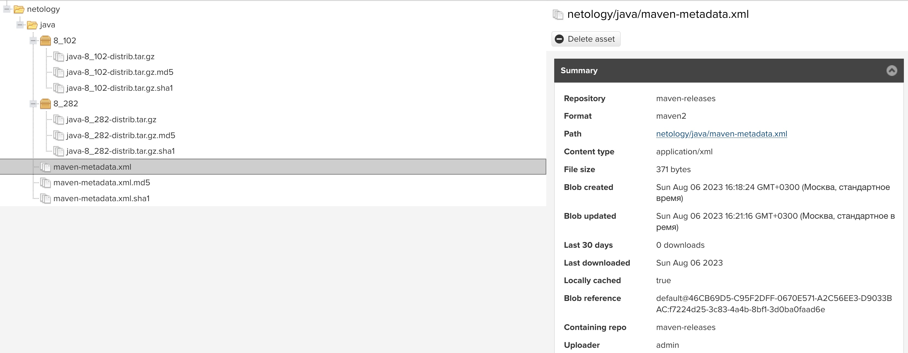
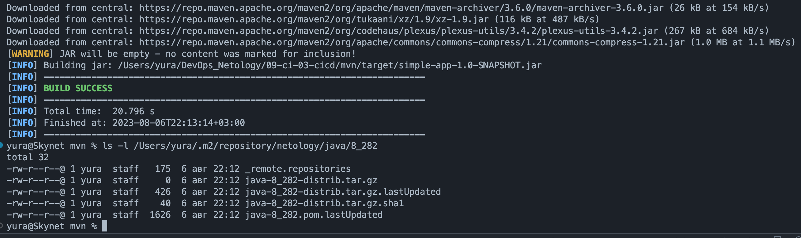

# Домашнее задание к занятию 9 «Процессы CI/CD»

## Знакомоство с SonarQube

### Основная часть

1. Создайте новый проект, название произвольное.
<p align="center">
  
</p>

2. Скачайте пакет sonar-scanner, который вам предлагает скачать SonarQube.
```
yura@Skynet ~ % ls -l ~/Downloads/sonar-scanner-5.0.1.3006-macosx
total 0
drwxr-xr-x@ 4 yura  staff  128 Aug  4 19:32 bin
drwxr-xr-x@ 3 yura  staff   96 Aug  4 19:31 conf
drwxr-xr-x@ 8 yura  staff  256 Aug  4 19:32 jre
drwxr-xr-x@ 3 yura  staff   96 Aug  4 19:32 lib
yura@Skynet ~ % ls -l ~/Downloads/sonar-scanner-5.0.1.3006-macosx/bin
total 16
-rwxr-xr-x@ 1 yura  staff  1822 Aug  4 19:31 sonar-scanner
-rwxr-xr-x@ 1 yura  staff   662 Aug  4 19:31 sonar-scanner-debug
yura@Skynet ~ %
```

3. Сделайте так, чтобы binary был доступен через вызов в shell (или поменяйте переменную PATH, или любой другой, удобный вам способ).
```
yura@Skynet bin % export PATH=$(pwd):$PATH
```

4. Проверьте `sonar-scanner --version`.
```
yura@Skynet bin % sonar-scanner --version
INFO: Scanner configuration file: /Users/yura/Downloads/sonar-scanner-5.0.1.3006-macosx/conf/sonar-scanner.properties
INFO: Project root configuration file: NONE
INFO: SonarScanner 5.0.1.3006
INFO: Java 17.0.7 Eclipse Adoptium (64-bit)
INFO: Mac OS X 13.4 x86_64
```

5. Запустите анализатор против кода из директории [example](./example) с дополнительным ключом `-Dsonar.coverage.exclusions=fail.py`.
```
yura@Skynet example % sonar-scanner \
  -Dsonar.projectKey=netology \
  -Dsonar.sources=. \
  -Dsonar.host.url=http://158.160.9.207:9000 \
  -Dsonar.login=30eeeb1f3fc484715bb8f35fcbcf3e1a37ebd9f5 \
  -Dsonar.coverage.exclusions=fail.py
```  

6. Посмотрите результат в интерфейсе.
<p align="center">
  
</p>

7. Исправьте ошибки, которые он выявил, включая warnings.
8. Запустите анализатор повторно — проверьте, что QG пройдены успешно.
<p align="center">
  
</p>

9. Сделайте скриншот успешного прохождения анализа, приложите к решению ДЗ.
<p align="center">
  
</p>

## Знакомство с Nexus

### Основная часть

1. В репозиторий `maven-public` загрузите артефакт с GAV-параметрами:

 *    groupId: netology;
 *    artifactId: java;
 *    version: 8_282;
 *    classifier: distrib;
 *    type: tar.gz.
   
2. В него же загрузите такой же артефакт, но с version: 8_102.
3. Проверьте, что все файлы загрузились успешно.
<p align="center">
  
</p>

4. В ответе пришлите файл `maven-metadata.xml` для этого артефекта.
[maven-metadata.xml]()

### Знакомство с Maven

### Подготовка к выполнению

1. Скачайте дистрибутив с [maven](https://maven.apache.org/download.cgi).
2. Разархивируйте, сделайте так, чтобы binary был доступен через вызов в shell (или поменяйте переменную PATH, или любой другой, удобный вам способ).
```
yura@Skynet bin % export PATH=$(pwd):$PATH
```
3. Удалите из `apache-maven-<version>/conf/settings.xml` упоминание о правиле, отвергающем HTTP- соединение — раздел mirrors —> id: my-repository-http-unblocker.
4. Проверьте `mvn --version`.
```
yura@Skynet bin % mvn --version
Apache Maven 3.9.4 (dfbb324ad4a7c8fb0bf182e6d91b0ae20e3d2dd9)
Maven home: /Users/yura/Downloads/apache-maven-3.9.4
Java version: 1.8.0_381, vendor: Oracle Corporation, runtime: /Library/Internet Plug-Ins/JavaAppletPlugin.plugin/Contents/Home
Default locale: ru_US, platform encoding: UTF-8
OS name: "mac os x", version: "13.4", arch: "aarch64", family: "mac"
```
5. Заберите директорию [mvn](./mvn) с pom.

### Основная часть

1. Поменяйте в `pom.xml` блок с зависимостями под ваш артефакт из первого пункта задания для Nexus (java с версией 8_282).
```
<dependencies>
    <dependency>
      <groupId>netology</groupId>
      <artifactId>java</artifactId>
      <version>8_282</version>
      <classifier>distrib</classifier>
      <type>tar.gz</type>
    </dependency>
```
2. Запустите команду `mvn package` в директории с `pom.xml`, ожидайте успешного окончания.
```
yura@Skynet mvn % mvn package
...

```
<p align="center">
  
</p>

3. Проверьте директорию `~/.m2/repository/`, найдите ваш артефакт.  
Ответ на предыдущем скриншоте ^  
4. В ответе пришлите исправленный файл `pom.xml`.
[pom.xml]()
